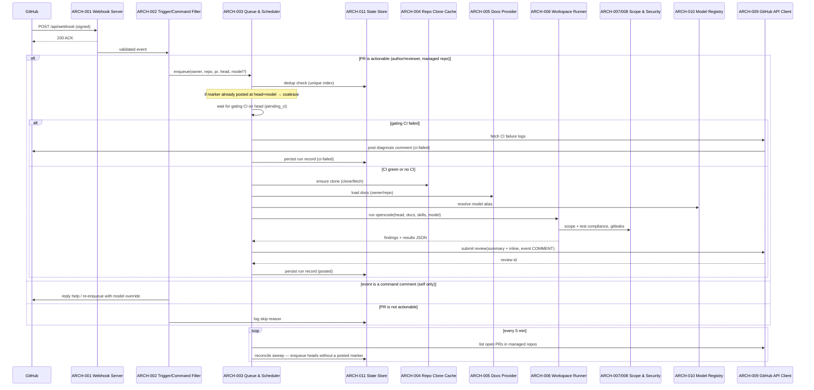

# Architecture Design: GitHub PR Review Agent

**Feature Branch**: `001-pr-reviewer-agent`
**Created**: 2026-08-01
**Status**: Approved
**Source**: `specs/001-pr-reviewer-agent/v-model/system-design.md`

## Overview

The architecture decomposes the 14 system components into 13 Python/FastAPI modules. The webhook boundary (ARCH-001/002) and the worker pipeline (ARCH-003) are cleanly separated so webhook ACKs are never blocked by long reviews. The review pipeline runs opencode as an external subprocess (ARCH-006) with all context (docs, skills, model) injected, orchestrated by the queue/scheduler. Storage is split between SQLite state (ARCH-011), an on-disk clone cache (ARCH-004), and run artifacts (ARCH-013). Three cross-cutting modules (state, config, observability) serve the rest.

## ID Schema

- **Architecture Module**: `ARCH-NNN` — sequential identifier for each module
- **Parent System Components**: Comma-separated `SYS-NNN` list per module (many-to-many)
- **Cross-Cutting Tag**: `[CROSS-CUTTING]` for infrastructure/utility modules not traceable to a specific SYS
- Example: `ARCH-003` with Parent System Components `SYS-003` — the queue/scheduler implements the coordinator

## Logical View — Component Breakdown (IEEE 42010 / Kruchten 4+1)

| ARCH ID | Name | Description | Parent System Components | Type |
|---------|------|-------------|--------------------------|------|
| ARCH-001 | Webhook Server | FastAPI HTTPS endpoint (uvicorn/ASGI); verifies HMAC; ACKs fast; publishes validated events to the dispatcher. | SYS-001 | Service |
| ARCH-002 | Trigger & Command Filter | Applies trigger rules (author/reviewer/CI completion) and `repo_config`/denylist; parses `@review --model <alias>` comment commands. | SYS-002, SYS-011 | Component |
| ARCH-003 | Queue & Scheduler | In-process queue + single worker (concurrency 1); dedup keyed on (repo, PR, head, model); CI-gate wait (`pending_ci`); retry with backoff; schedules re-reviews on `synchronize`; runs the periodic reconcile sweep. | SYS-003 | Component |
| ARCH-004 | Repo Clone Cache | Isolated per-repo clone workspace inside container (`/var/agent_cache/repos`); plain `git clone` over HTTPS using the PAT, incremental fetches to head, evicted by LRU. | SYS-004 | Library |
| ARCH-005 | Docs Provider | Reads this repo's `specs/<owner>/<repo>/` markdown tree; returns doc file list + contents; records degradation when absent. | SYS-005 | Library |
| ARCH-006 | Workspace Runner | Spawns a one-off `opencode run` CLI subprocess with `cwd` set to the checkout (read-only), passing repo `AGENTS.md` + `.opencode/` skills, docs, resolved model, and minimal `agent_skill_set` (`/code-review`, `/diagnosing-bugs`, `/resolving-merge-conflicts`); collects the structured-JSON result. | SYS-006 | Component |
| ARCH-007 | Scope & Test Compliance Validator | Validates change scope boundaries (modified files match PR title/body/issues) and verifies test case additions adhere to repo rules in `AGENTS.md` / `.opencode/`. Discovery + compliance only — never executes the repo's test suites. | SYS-007 | Library |
| ARCH-008 | Security & CI Debug Pipeline | Runs security scans (gitleaks secrets + LLM review inside the review session) on green heads and fetches/debugs GitHub CI/CD failure logs on `check_run`/`workflow_run` events to produce a root-cause diagnosis comment for failed gates. | SYS-008 | Service |
| ARCH-009 | GitHub API Client | Thin typed client over the PAT (`repo` scope): PR reads, diff fetch, CI job log fetch, comment create, review submit (`COMMENT`), webhook register/re-point; rate-limit aware. | SYS-009 | Library |
| ARCH-010 | Model Registry | Resolves aliases (`free` → `opencode`, `go` → `opencode-go`; `gemini` defined but disabled) to provider/model/auth reference against the single application-layer model definition (REQ-016); validates aliases; supports credit fallback to `switch_default`. | SYS-010 | Library |
| ARCH-011 | State Store | SQLite access layer (Python `sqlite3`/`aiosqlite`, WAL): schema, migrations, transactional dedup, run-record persistence. Shared by every stateful path. | SYS-012 | Library |
| ARCH-012 | Config Loader | Loads and validates `config.yaml`; typed accessors for providers, `repo_config`, denylist, defaults, concurrency, CI-gate settings, retry policy, docs location, and agent skill set. | SYS-013 | Utility |
| ARCH-013 | Observability & Runtime | Process lifecycle (graceful shutdown, restart-safe recovery), structured JSON logs, `.runs/` persistence, rate-limit handling, secret hygiene. Cross-cutting infrastructure. | SYS-014 | Utility |

## Process View — Dynamic Behavior (Kruchten 4+1)

### Interaction: Review Pipeline

**Concurrency Model**: Single `asyncio` event loop for webhook handling (FastAPI/uvicorn); one worker for review runs (concurrency 1); SQLite with WAL for cross-worker consistency.
**Synchronization Points**: Dedup insert is a single transactional `INSERT OR IGNORE`; run status transitions guarded by the same transaction (pending_ci → queued → running → posted/ci-failed/partial/skipped).

## Interface View — API Contracts (Kruchten 4+1)

### ARCH-001: Webhook Server

| Direction | Name | Type | Format | Constraints |
|-----------|------|------|--------|-------------|
| Input | delivery | object | GitHub webhook JSON | Requires `X-Hub-Signature-256` valid; `X-GitHub-Event` in supported set |
| Output | ack | HTTP status | 200/204 | Returned < 2s (REQ-NF-002) |
| Exception | bad-signature | HTTP 401 | — | Thrown when HMAC mismatch; payload discarded |

### ARCH-002: Trigger & Command Filter

| Direction | Name | Type | Format | Constraints |
|-----------|------|------|--------|-------------|
| Input | event | object | Normalized webhook event | From ARCH-001 |
| Output | decision | `{action, owner, repo, pr, head, model?}` | Object | `action ∈ {review, skip, reply, re-enqueue}` |
| Exception | malformed-command | Reply message | Text | Help text with valid aliases |

### ARCH-003: Queue & Scheduler

| Direction | Name | Type | Format | Constraints |
|-----------|------|------|--------|-------------|
| Input | enqueue | job | `{owner, repo, pr, head, model?, trigger, attempt}` | Dedup key = (repo, pr, head, model) |
| Output | run-result | job result | `{status, reviewId?, error?}` | `status ∈ {posted, ci-failed, partial, failed, skipped}` |
| Exception | backoff | retry schedule | Duration | Exponential with jitter; 3 attempts max |

### ARCH-004: Repo Clone Cache

| Direction | Name | Type | Format | Constraints |
|-----------|------|------|--------|-------------|
| Input | ensure | `(owner, repo)` | Strings | — |
| Output | checkout | absolute path | String | Exists, `.git` present, at/including head |
| Exception | clone-failure | Error | — | Categorized retryable; run retried then partial-report |

### ARCH-005: Docs Provider

| Direction | Name | Type | Format | Constraints |
|-----------|------|------|--------|-------------|
| Input | load | `(owner, repo)` | Strings | — |
| Output | docs | `{files, content}` | Object | Empty when folder absent; `degraded: true` recorded |
| Exception | unreachable | Warning | — | Degrades, never aborts the run |

### ARCH-006: Workspace Runner

| Direction | Name | Type | Format | Constraints |
|-----------|------|------|--------|-------------|
| Input | run | `{checkout, head, docs, modelAlias, skillsDirs, skillSet}` | Object | cwd = checkout; read-only enforced; `skillSet` from MOD-019 (`code-review` base + situational skills) |
| Output | result | JSON | Findings + results | Parsed from opencode output; validated schema |
| Exception | opencode-failure | Exit code | — | Non-zero exit classified; retryable vs reportable |

### ARCH-007: Scope & Test Compliance Validator

| Direction | Name | Type | Format | Constraints |
|-----------|------|------|--------|-------------|
| Input | validate | `(checkout, prContext)` | Path + object | `prContext` = PR title/body/issues + diff files |
| Output | report | `{scope, testCompliance}` | Object | `scope`/`testCompliance` findings; discovery + compliance only — no test execution |
| Exception | unreachable | Warning | — | Recorded; never aborts |

### ARCH-008: Security & CI Debug Pipeline

| Direction | Name | Type | Format | Constraints |
|-----------|------|------|--------|-------------|
| Input | scan | `(checkout, diffFiles)` | Path + list | Green heads only |
| Output | report | `{secrets, llm}` | Object | Normalized findings with severity; LLM review runs inside the review session |
| Exception | tool-missing | Warning | — | Phase skipped + logged; never aborts |

### ARCH-009: GitHub API Client

| Direction | Name | Type | Format | Constraints |
|-----------|------|------|--------|-------------|
| Input | submitReview | `(owner, repo, pr, head, payload)` | Object | `payload = {body, event, comments[]}` |
| Output | reviewId | Number | — | Posted review id |
| Exception | 403/429 | Retry | — | Exponential backoff (REQ-NF-003) |

### ARCH-010: Model Registry

| Direction | Name | Type | Format | Constraints |
|-----------|------|------|--------|-------------|
| Input | resolve | `(alias?)` | String | Optional; default if omitted |
| Input | switchDefault | `(alias)` | String | Config-only change; takes effect on next run (REQ-016) |
| Output | model | `{provider, model, authRef}` | Object | `authRef` is an env var name, never the key |
| Exception | unknown-alias | Error | — | Caller replies with valid aliases |

### ARCH-011: State Store

| Direction | Name | Type | Format | Constraints |
|-----------|------|------|--------|-------------|
| Input | dedupInsert | `(owner, repo, pr, head, model)` | Strings | `INSERT OR IGNORE`; unique index |
| Input | updateRun | `(runId, patch)` | Object | Transactional state machine transitions |
| Output | run | ReviewRun | Record | Schema per REQ-IF-005 |
| Exception | constraint-violation | Error | — | Coalesced as duplicate (not failure) |

### ARCH-012: Config Loader

| Direction | Name | Type | Format | Constraints |
|-----------|------|------|--------|-------------|
| Input | load | `config.yaml` | YAML | Validated against JSON schema |
| Output | config | Typed config | Object | Fail-closed on invalid config at boot |
| Exception | invalid | Error | — | Service refuses to start |

### ARCH-013: Observability & Runtime

| Direction | Name | Type | Format | Constraints |
|-----------|------|------|--------|-------------|
| Input | log/record | run context | Object | JSON lines to stdout + `.runs/<id>/` |
| Output | shutdown | signal | — | Drains queue, closes DB, exits 0 |
| Exception | rate-limit | backoff | — | Central 403/429 policy |

## Data Flow View — Data Transformation Chains (Kruchten 4+1)

### Data Flow: Webhook to Posted Review

| Stage | Module | Input Format | Transformation | Output Format |
|-------|--------|-------------|----------------|---------------|
| 1 | ARCH-001 | Signed webhook JSON | Verify HMAC; normalize event | Normalized event |
| 2 | ARCH-002 | Normalized event | Filter + command parse | Decision `{action,…}` |
| 3 | ARCH-003 | Decision | Dedup; queue; resolve model | ReviewRun job |
| 4 | ARCH-004/005 | Job | Clone + docs | Checkout path + docs |
| 5 | ARCH-006 | Checkout + docs + model + skill set | opencode CLI subprocess run | Findings JSON |
| 6 | ARCH-007/008 | Checkout + diff | Scope/test-compliance + gitleaks | Compliance report + security report |
| 7 | ARCH-009 | Findings + reports | Assemble + post review | GitHub review + run record |

---

## Coverage Summary

| Metric | Count |
|--------|-------|
| Total Architecture Modules (ARCH) | 13 (13 active, 0 deprecated, 0 suspect) |
| Cross-Cutting Modules | 3 |
| Total Parent System Components Covered | 14 / 14 (100%) (active items only) |
| Modules per Type | Component: 4 \| Service: 2 \| Library: 4 \| Utility: 2 |
| **Forward Coverage (SYS→ARCH)** | **100%** |

## Derived Modules

None — all modules trace to existing system components.
