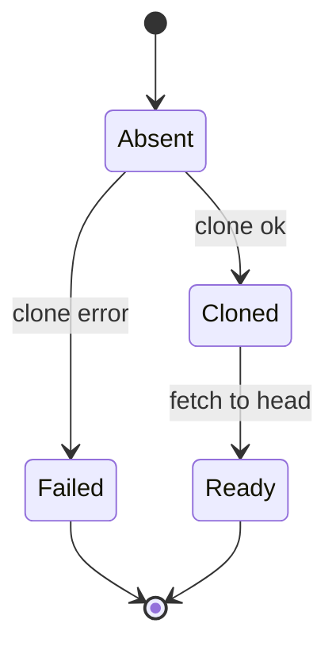
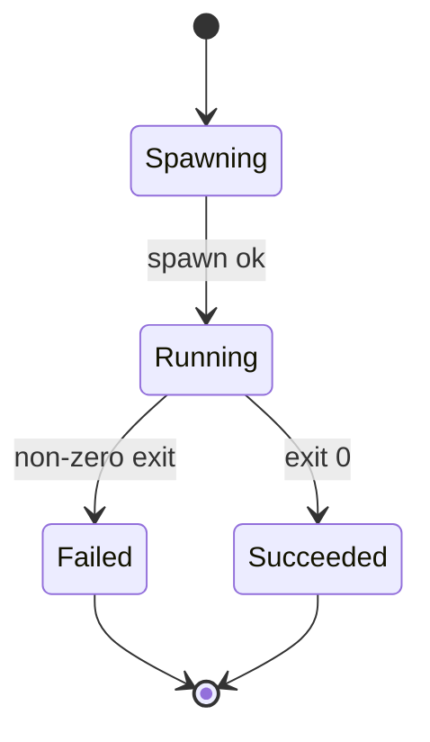
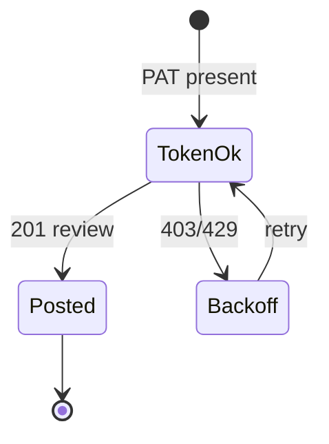
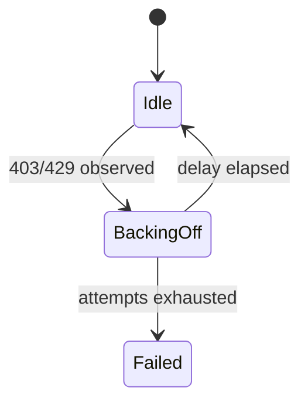

# Module Design: GitHub PR Review Agent

**Feature Branch**: `001-pr-reviewer-agent`
**Created**: 2026-08-01
**Status**: Approved
**Source**: `specs/001-pr-reviewer-agent/v-model/architecture-design.md`

## Overview

The 13 architecture modules are decomposed into 18 implementable low-level modules. Each module below is specified at a level where coding is a translation exercise: algorithms are pseudocode, state machines are explicit, internal data is tabled, and error handling maps to the ARCH interface contracts. Target source files follow a single Python/FastAPI package layout under `src/`.

## ID Schema

- **Module Design**: `MOD-NNN` — sequential identifier (3-digit zero-padded)
- **Parent Architecture Modules**: Comma-separated `ARCH-NNN` list
- **Target Source File(s)**: Comma-separated file paths

### Module: MOD-001 (Webhook Handler)

**Parent Architecture Modules**: ARCH-001
**Target Source File(s)**: `src/webhook/handler.py`

#### Algorithmic / Logic View

```pseudocode
FUNCTION handleWebhook(req) -> Ack:
    payload = req.body
    sig = req.headers["x-hub-signature-256"]
    IF sig == NULL OR NOT verifyHmac(secret, payload, sig):
        RETURN 401  // REQ-001 — HMAC mandatory
    event = req.headers["x-github-event"]
    IF event NOT IN {pull_request, issue_comment, check_run, workflow_run}:
        RETURN 204  // ignore silently
    normalized = normalizeEvent(event, payload)
    dispatcher.dispatch(normalized)   // async, non-blocking
    RETURN 200  // ACK < 2s (REQ-NF-002)
```

Event/action gating: `pull_request` actions `opened`/`ready_for_review`/`synchronize`/`review_requested` (plus `closed`/`merged` → skip), `issue_comment` action `created` (self only), `check_run`/`workflow_run` action `completed`. All other actions/events → 204 (ignored silently).

#### State Machine View

N/A — Stateless

#### Internal Data Structures

| Name | Type | Size/Constraints | Initialization | Description |
|------|------|-----------------|----------------|-------------|
| supportedEvents | Set | 4 entries | const | Events the system reacts to (`pull_request`, `issue_comment`, `check_run`, `workflow_run`) |
| supportedActions | Map | per event | const | Action filter per event (`opened`, `ready_for_review`, `synchronize`, `review_requested`, `created`, `completed`) |
| normalized | object | — | per request | Typed event for the dispatcher |

#### Error Handling & Return Codes

| Error Condition | Error Code / Exception | Architecture Contract | Recovery |
|----------------|----------------------|----------------------|----------|
| Bad HMAC signature | HTTP 401 | ARCH-001 `bad-signature` | Discard payload; log |
| Malformed body | HTTP 400 | ARCH-001 | Log; no dispatch |
| Unsupported event | HTTP 204 | ARCH-001 | Ignore |

---

### Module: MOD-002 (Trigger Decision Engine)

**Parent Architecture Modules**: ARCH-002
**Target Source File(s)**: `src/filter/trigger.py`

#### Algorithmic / Logic View

```pseudocode
FUNCTION decide(event, config, selfAccount) -> Decision:
    IF event.type == issue_comment:
        IF event.comment.author != selfAccount:
            RETURN {action: "skip", reason: "not-self"}       // only self comments honored
        RETURN {action: "reply", target: parseCommand(event)}   // MOD-003
    IF event.type IN {check_run, workflow_run} AND event.action == completed:
        RETURN {action: "advance-ci", owner, repo, pr, head, ci_status}   // drives the CI gate
    IF event.pr.state IN {closed, merged}:
        RETURN {action: "skip", reason: "not-open"}
    isAuthor = event.pr.author == selfAccount AND event.action IN {opened, ready_for_review}
    isReviewer = event.action == review_requested AND selfAccount IN event.pr.requested_reviewers
    IF NOT (isAuthor OR isReviewer):
        RETURN {action: "skip", reason: "not-self"}
    IF NOT managedByConfig(event.repo, config.repo_config):   // REQ-003
        RETURN {action: "skip", reason: "not-managed"}
    IF event.repo IN config.denylist:
        RETURN {action: "skip", reason: "denied"}
    RETURN {action: "enqueue", owner, repo, pr, head}
```

#### State Machine View

N/A — Stateless

#### Internal Data Structures

| Name | Type | Size/Constraints | Initialization | Description |
|------|------|-----------------|----------------|-------------|
| Decision | object | — | per event | `{action, target?, reason?}` |

#### Error Handling & Return Codes

| Error Condition | Error Code / Exception | Architecture Contract | Recovery |
|----------------|----------------------|----------------------|----------|
| Malformed PR payload | Error | ARCH-002 | Log; skip |
| repo_config/denylist invalid | ConfigError | ARCH-012 | Fail-closed (no review) |

---

### Module: MOD-003 (Command Parser)

**Parent Architecture Modules**: ARCH-002
**Target Source File(s)**: `src/filter/command.py`

#### Algorithmic / Logic View

```pseudocode
FUNCTION parseCommand(body) -> Command | Help:
    m = regexMatch(body, /^@review\s+(--model\s+(\S+))?$/m)
    IF m == NULL:
        RETURN {kind: "help", text: USAGE}         // REQ-013
    model = m[2] OR DEFAULT_ALIAS
    RETURN {kind: "review", model}
```

#### State Machine View

N/A — Stateless

#### Internal Data Structures

| Name | Type | Size/Constraints | Initialization | Description |
|------|------|-----------------|----------------|-------------|
| USAGE | string | const | — | Help text listing valid aliases |

#### Error Handling & Return Codes

| Error Condition | Error Code / Exception | Architecture Contract | Recovery |
|----------------|----------------------|----------------------|----------|
| Malformed command | Help reply | ARCH-002 `malformed-command` | Reply with usage; no run |

---

### Module: MOD-004 (Queue Manager)

**Parent Architecture Modules**: ARCH-003
**Target Source File(s)**: `src/queue/manager.py`

#### Algorithmic / Logic View

```pseudocode
FUNCTION enqueue(job) -> RunId:
    // Dedup: unique (owner, repo, pr, head, model) — REQ-004 / REQ-NF-005
    inserted = state.insertRun({..., status: "pending_ci"})   // INSERT OR IGNORE
    IF NOT inserted:
        RETURN {duplicate: true}                          // coalesce
    ciGate.watch(job)                                      // begin waiting on gating CI (MOD-009)
    queue.push(job)
    scheduler.wake()
    RETURN {runId: job.id}
```

#### State Machine View

```mermaid
stateDiagram-v2
    [*] --> pending_ci : enqueue (dedup insert ok; waiting on gating CI)
    pending_ci --> queued : CI green or no CI (bypass window)
    pending_ci --> skipped : CI timeout (wait cap) / PR closed
    pending_ci --> ci-failed : gating failure → diagnosis comment
    queued --> running : worker claim (tx)
    running --> posted : review submitted
    running --> failed : max retries exceeded
    running --> partial : incomplete report posted
    failed --> running : retry (backoff) [attempt < max]
    partial --> posted : follow-up completes
    ci-failed --> [*]
    failed --> [*]
    posted --> [*]
    skipped --> [*]
```

#### Internal Data Structures

| Name | Type | Size/Constraints | Initialization | Description |
|------|------|-----------------|----------------|-------------|
| queue | FIFO | bounded by worker count | empty | Pending ReviewRun jobs |
| attempts | Map<RunId, int> | ≤ maxAttempts | 0 | Retry counters |

#### Error Handling & Return Codes

| Error Condition | Error Code / Exception | Architecture Contract | Recovery |
|----------------|----------------------|----------------------|----------|
| Duplicate job | DuplicateResult | ARCH-003 | Coalesce; no new work |
| DB locked | retryable error | ARCH-011 | Re-try transaction |

---

### Module: MOD-005 (Worker Scheduler)

**Parent Architecture Modules**: ARCH-003
**Target Source File(s)**: `src/queue/worker.py`

#### Algorithmic / Logic View

```pseudocode
FUNCTION runWorker():
    LOOP:
        job = queue.dequeue(claim: set status running in tx)   // REQ-NF-005
        IF job == NULL: sleep(backoff); CONTINUE
        result = pipeline.execute(job)                          // MOD-006..MOD-012
        IF result.isTransient AND job.attempts < maxAttempts:
            state.setStatus(job, "queued")                      // retry
            queue.push({...job, attempts: attempts+1})          // REQ-014
        ELSE IF result.isTransient:
            state.setStatus(job, "failed"); report.partial(job) // partial report
        ELSE:
            state.setStatus(job, result.status)                 // posted/partial
```

**State Machine View**: (delegates to MOD-004 status machine)

#### Internal Data Structures

| Name | Type | Size/Constraints | Initialization | Description |
|------|------|-----------------|----------------|-------------|
| concurrency | int | default 1 (REQ-NF-006) | from config | Active worker count (serial execution) |

#### Error Handling & Return Codes

| Error Condition | Error Code / Exception | Architecture Contract | Recovery |
|----------------|----------------------|----------------------|----------|
| Crash mid-run | orphaned run | ARCH-011 | Boot sweep: requeue `running` older than lease TTL |
| Poison job | max attempts | ARCH-003 | partial-report, mark failed |

---

### Module: MOD-006 (Clone Cache Manager)

**Parent Architecture Modules**: ARCH-004
**Target Source File(s)**: `src/cache/clone.py`

#### Algorithmic / Logic View

```pseudocode
FUNCTION ensure(owner, repo, head) -> checkoutPath:
    key = owner + "/" + repo
    entry = state.getRepo(key)
    path = cacheRoot + "/" + key
    IF entry == NULL:
        gitClone(url, path)                         // first use (REQ-005)
        state.putRepo({key, path, lastUsed: now})
    ELSE:
        gitFetch(path, head)                        // incremental (REQ-005)
        touch(path)
    IF diskUsage > diskCap:
        evictLRUExcept(path)                        // LRU eviction
    RETURN path
```

#### State Machine View



#### Internal Data Structures

| Name | Type | Size/Constraints | Initialization | Description |
|------|------|-----------------|----------------|-------------|
| repos | Map<key, CachedRepo> | bounded by disk cap | empty | last-used timestamps |
| cacheRoot | path | — | from config | `.cache/repos/` |

#### Error Handling & Return Codes

| Error Condition | Error Code / Exception | Architecture Contract | Recovery |
|----------------|----------------------|----------------------|----------|
| Clone fails | retryable | ARCH-004 | Run retried; then partial-report |
| Disk full | Error | ARCH-004 | Evict aggressively; report |

---

### Module: MOD-007 (Docs Loader)

**Parent Architecture Modules**: ARCH-005
**Target Source File(s)**: `src/docs/loader.py`

#### Algorithmic / Logic View

```pseudocode
FUNCTION load(owner, repo) -> Docs:
    treeRoot = config.specs_docs_dir                     // e.g. "specs" in this repo
    folder = treeRoot + "/" + owner + "/" + repo
    IF NOT exists(folder):
        RETURN {files: [], degraded: true}               // REQ-006 graceful
    files = listMarkdown(folder)
    RETURN {files: files, content: readFiles(files), degraded: false}
```

#### State Machine View

N/A — Stateless (per-run read against the local docs tree)

#### Internal Data Structures

| Name | Type | Size/Constraints | Initialization | Description |
|------|------|-----------------|----------------|-------------|
| Docs | object | — | per call | `{files, content, degraded}` |

#### Error Handling & Return Codes

| Error Condition | Error Code / Exception | Architecture Contract | Recovery |
|----------------|----------------------|----------------------|----------|
| docs tree unreadable | Warning | ARCH-005 `unreachable` | Degrade; record; continue (REQ-006) |

---

### Module: MOD-008 (Workspace Runner)

**Parent Architecture Modules**: ARCH-006
**Target Source File(s)**: `src/runner/workspace.py`

#### Algorithmic / Logic View

```pseudocode
FUNCTION run(checkout, head, docs, modelAlias) -> Result:
    model = modelRegistry.resolve(modelAlias)           // MOD-014; unknown ⇒ reply
    skillSet = skillSetSelector.select(findings)        // MOD-019; code-review base
    env = buildEnv(model.authRef)                       // keys via env only (REQ-NF-004)
    prompt = assembleReviewPrompt(head, docs, model, skillSet)  // context: docs + diff + checks
    proc = spawn("opencode", ["run", "--non-interactive", prompt], {
        cwd: checkout,
        env: env,
        readOnlyGit: true                               // REQ-CN-004
    })
    output = collect(proc)
    IF proc.exitCode != 0:
        RETURN {status: classify(exitCode)}             // retryable vs reportable
    RETURN parseResult(output)                          // findings + results JSON
```

#### State Machine View



#### Internal Data Structures

| Name | Type | Size/Constraints | Initialization | Description |
|------|------|-----------------|----------------|-------------|
| env | object | keys only via authRef | per run | Provider keys injected, never logged |
| output | string | bounded MB | — | Captured stdout/stderr |

#### Error Handling & Return Codes

| Error Condition | Error Code / Exception | Architecture Contract | Recovery |
|----------------|----------------------|----------------------|----------|
| opencode missing | NonZero exit 127 | ARCH-006 `opencode-failure` | Retry then partial-report |
| Model provider outage | NonZero exit | ARCH-006 | Retryable (REQ-014) |

---

### Module: MOD-009 (CI Gate Monitor)

**Parent Architecture Modules**: ARCH-003
**Target Source File(s)**: `src/ci/gate.py`

#### Algorithmic / Logic View

```pseudocode
FUNCTION watch(job) -> void:                       // runs while job.status == pending_ci
    IF noCIForHead(job.head):                       // no check/workflow runs after settle window
        state.setStatus(job, "queued")              // no-CI bypass
        RETURN
    runs = pollCheckRuns(job.head)                  // every poll interval
    IF allRunsComplete(runs):
        IF anyRunFailed(runs):                      // Rule B
            state.setStatus(job, "ci-failed")
            logs = github.fetchFailureLogs(job, runs)
            diagnosis = diagnoseFailure(logs)        // /diagnosing-bugs context
            github.postComment(job, diagnosis)       // ci-failed diagnosis comment
        ELSE:
            state.setStatus(job, "queued")           // green → review proceeds
    IF elapsed > config.ci_gate.wait_cap_minutes:    // 60-min cap
        state.setStatus(job, "skipped")
        github.postComment(job, "CI hasn't completed; no review run")  // one comment, then silent
```

#### State Machine View

N/A — drives the `pending_ci` → `queued` / `ci-failed` / `skipped` transitions in MOD-004.

#### Internal Data Structures

| Name | Type | Size/Constraints | Initialization | Description |
|------|------|-----------------|----------------|-------------|
| pollInterval | Duration | const | from config | Check-run polling cadence |
| settleWindow | Duration | const | 75s | No-CI bypass window |

#### Error Handling & Return Codes

| Error Condition | Error Code / Exception | Architecture Contract | Recovery |
|----------------|----------------------|----------------------|----------|
| CI log fetch fails | Warning | ARCH-008 | Diagnosis comment notes log unavailability |
| Poll API 403/429 | Retryable | ARCH-009 | Backoff; stays in `pending_ci` |

---

### Module: MOD-010 (Test Compliance Validator)

**Parent Architecture Modules**: ARCH-007
**Target Source File(s)**: `src/tests/compliance.py`

#### Algorithmic / Logic View

```pseudocode
FUNCTION validate(checkout, prContext, repoConfig) -> ComplianceReport:
    // Discovery + compliance ONLY — the container NEVER executes the repo's test suites.
    addedTests = discoverTestFiles(prContext.diffFiles)        // paths matching test patterns
    conventions = inferConventions(checkout)                    // existing test layout, AGENTS.md, CONTRIBUTING.md
    missing = findChangedModulesWithoutTests(prContext.diffFiles, addedTests, conventions)
    RETURN {
        addedTestFiles: addedTests,
        conventions: conventions,
        missingCoverage: missing,            // modules changed but no test added
        violatingTests: violations(addedTests, conventions)
    }
```

#### State Machine View

N/A — Stateless

#### Internal Data Structures

| Name | Type | Size/Constraints | Initialization | Description |
|------|------|-----------------|----------------|-------------|
| addedTestFiles | array | — | discover | Test files added/renamed in the diff |
| missingCoverage | array | — | empty | Changed modules lacking a test addition |
| conventions | object | — | infer | Inferred test patterns (AGENTS.md, CONTRIBUTING.md, layout) |

#### Error Handling & Return Codes

| Error Condition | Error Code / Exception | Architecture Contract | Recovery |
|----------------|----------------------|----------------------|----------|
| No conventions found | empty conventions | ARCH-007 | Reported as finding |
| No tests found | empty report | ARCH-007 | Recorded as finding |

---

### Module: MOD-011 (Security Scan Runner)

**Parent Architecture Modules**: ARCH-008
**Target Source File(s)**: `src/security/scanner.py`

#### Algorithmic / Logic View

```pseudocode
FUNCTION scan(checkout, diffFiles) -> SecReport:
    secrets  = runGitleaks(checkout)                      // full checkout (REQ-009)
    RETURN {secrets: normalize(secrets)}
    // LLM security review of the diff runs inside the single review session (MOD-012), fed by these findings
```

#### State Machine View

N/A — Stateless

#### Internal Data Structures

| Name | Type | Size/Constraints | Initialization | Description |
|------|------|-----------------|----------------|-------------|
| reports | object | — | per call | Normalized findings by tool (`{secrets}`) |

#### Error Handling & Return Codes

| Error Condition | Error Code / Exception | Architecture Contract | Recovery |
|----------------|----------------------|----------------------|----------|
| Tool missing | Warning | ARCH-008 `tool-missing` | Phase skipped + logged |
| Scan timeout | Error | ARCH-008 | Phase result marked partial |

---

### Module: MOD-012 (LLM Security Reviewer)

**Parent Architecture Modules**: ARCH-008
**Target Source File(s)**: `src/security/llm.py`

#### Algorithmic / Logic View

```pseudocode
FUNCTION review(diffFiles, toolFindings, docs, model) -> Findings:
    // Runs INSIDE the single `opencode run` session (MOD-008) — the /code-review prompt
    // includes a security step; no separate model call.
    context = buildSecurityPrompt(diffFiles, toolFindings, docs)
    result = workspaceRunner.securityStep(context, model)  // same session
    RETURN parseFindings(result)                           // {severity, file, line, detail}
```

#### State Machine View

N/A — Stateless

#### Internal Data Structures

| Name | Type | Size/Constraints | Initialization | Description |
|------|------|-----------------|----------------|-------------|
| Findings | array | ≤ cap | empty | Deduplicated, severity-ordered |

#### Error Handling & Return Codes

| Error Condition | Error Code / Exception | Architecture Contract | Recovery |
|----------------|----------------------|----------------------|----------|
| LLM call fails | Error | ARCH-006 | Retryable; partial phase |

---

### Module: MOD-013 (GitHub Client)

**Parent Architecture Modules**: ARCH-009
**Target Source File(s)**: `src/github/client.py`

#### Algorithmic / Logic View

```pseudocode
FUNCTION submitReview(owner, repo, pr, head, payload) -> reviewId:
    token = config.env("GITHUB_TOKEN")                    // PAT, repo scope (no App installation)
    res = retryWithBackoff(() =>
        POST /repos/{owner}/{repo}/pulls/{pr}/reviews
        body: {commit_id: head, event: "COMMENT",         // always COMMENT (REQ-012)
               body: summary + idempotencyMarker(runId),
               comments: inlineComments},
        {onRetryable: is403or429})                        // REQ-NF-003
    RETURN res.data.id
```

Webhook registration/re-point (setup-time `gh api`; runtime self-heal) uses the same PAT via `httpx` — see `contracts/github-api.md`.

#### State Machine View



#### Internal Data Structures

| Name | Type | Size/Constraints | Initialization | Description |
|------|------|-----------------|----------------|-------------|
| tokenCache | {token} | — | from env | PAT from `GITHUB_TOKEN` env (never logged) |

#### Error Handling & Return Codes

| Error Condition | Error Code / Exception | Architecture Contract | Recovery |
|----------------|----------------------|----------------------|----------|
| 403/429 | Retryable | ARCH-009 | Backoff (REQ-NF-003) |
| 404 (PR gone) | Skip | ARCH-009 | Mark run skipped, no post |

---

### Module: MOD-014 (Model Resolver)

**Parent Architecture Modules**: ARCH-010
**Target Source File(s)**: `src/models/registry.py`

#### Algorithmic / Logic View

```pseudocode
FUNCTION resolve(alias?) -> ResolvedModel:
    a = alias ?? config.defaultModel
    entry = config.providers[a]
    IF entry == NULL:
        THROW UnknownAlias(a, validAliases(config.providers))
    RETURN {provider: entry.provider,
            model: entry.model,
            authRef: entry.authEnvVar}                    // key name, never value

FUNCTION switchDefault(alias) -> void:
    // REQ-016: single app-layer definition, config-only switch.
    // Persists defaultModel; takes effect on the next resolve() call.
    IF alias NOT IN config.providers:
        THROW UnknownAlias(alias, validAliases(config.providers))
    config.defaultModel = alias
```

#### State Machine View

N/A — Stateless

#### Internal Data Structures

| Name | Type | Size/Constraints | Initialization | Description |
|------|------|-----------------|----------------|-------------|
| providers | map | from config | — | alias → provider spec |

#### Error Handling & Return Codes

| Error Condition | Error Code / Exception | Architecture Contract | Recovery |
|----------------|----------------------|----------------------|----------|
| Unknown alias | UnknownAlias | ARCH-010 | Caller replies with valid aliases (REQ-013) |
| Missing key env | Error | ARCH-010 | Reported as misconfigured; no run |
| Switch to unknown alias | UnknownAlias | ARCH-010 | Config change rejected; prior default kept (REQ-016) |

---

### Module: MOD-015 (State Repository)

**Parent Architecture Modules**: ARCH-011
**Target Source File(s)**: `src/state/db.py`

#### Algorithmic / Logic View

```pseudocode
FUNCTION migrateAndOpen(dbPath) -> Db:
    db = open(dbPath, {journal_mode: WAL})                // REQ-IF-005
    migrate(db)   // tables: review_runs, repos, model_aliases, repo_config
    RETURN db

FUNCTION dedupInsert(run) -> bool:
    BEGIN
    n = INSERT OR IGNORE INTO review_runs
        (owner, repo, pr, head, model, status) VALUES (...)
    COMMIT
    RETURN n.rowsAffected == 1                             // REQ-004 / REQ-NF-005

FUNCTION recoverOrphans(db):
    UPDATE review_runs SET status='queued'
        WHERE status='running' AND updated_at < now - leaseTTL   // crash-safe
    UPDATE review_runs SET status='pending_ci'
        WHERE status='queued' AND ci-gate not yet satisfied      // resume CI wait
    RETURN reconcileSweep(db)   // enqueue open PR heads lacking a posted marker
```

#### State Machine View

N/A — Stateless (schema + transactions)

#### Internal Data Structures

| Name | Type | Size/Constraints | Initialization | Description |
|------|------|-----------------|----------------|-------------|
| review_runs | table | unique(owner,repo,pr,head,model) | — | Run records |
| repos | table | unique(owner,repo) | — | Cache metadata |

#### Error Handling & Return Codes

| Error Condition | Error Code / Exception | Architecture Contract | Recovery |
|----------------|----------------------|----------------------|----------|
| Unique violation | Coalesced | ARCH-011 | Duplicate handled as no-op |
| DB locked | retryable | ARCH-011 | Transaction retry |

---

### Module: MOD-016 (Config Validator)

**Parent Architecture Modules**: ARCH-012
**Target Source File(s)**: `src/config/load.py`

#### Algorithmic / Logic View

```pseudocode
FUNCTION loadConfig(path) -> Config:
    raw = yaml.parse(readFile(path))
    validate(raw, CONFIG_SCHEMA)                          // fail-closed (ARCH-012)
    IF raw.defaultModel NOT IN raw.providers:
        THROW ConfigError("default_model must be a defined provider alias")  // REQ-016
    IF NOT raw.providers[raw.defaultModel].enabled:
        THROW ConfigError("default_model must reference an enabled alias")   // REQ-016
    IF raw.repo_config IS EMPTY:
        THROW ConfigError("repo_config must list at least one managed repo")  // REQ-003
    RETURN typedConfig(raw)                                // defaults applied
```

#### State Machine View

N/A — Stateless

#### Internal Data Structures

| Name | Type | Size/Constraints | Initialization | Description |
|------|------|-----------------|----------------|-------------|
| CONFIG_SCHEMA | object | const | — | JSON schema for config.yaml |

#### Error Handling & Return Codes

| Error Condition | Error Code / Exception | Architecture Contract | Recovery |
|----------------|----------------------|----------------------|----------|
| Invalid config | ConfigError | ARCH-012 | Service refuses to start (REQ-IF-004) |
| Missing file | ConfigError | ARCH-012 | Boot failure with clear message |

---

### Module: MOD-017 (Logger & Run Records)

**Parent Architecture Modules**: ARCH-013
**Target Source File(s)**: `src/observability/log.py`

#### Algorithmic / Logic View

```pseudocode
FUNCTION log(runId, phase, level, fields):
    line = jsonLine({ts, runId, phase, level, ...fields})   // REQ-015
    stdout(line)                                             // structured JSON
    IF runId != NULL:
        appendFile(".runs/" + runId + "/run.jsonl", line)    // persisted records
```

#### State Machine View

N/A — Stateless

#### Internal Data Structures

| Name | Type | Size/Constraints | Initialization | Description |
|------|------|-----------------|----------------|-------------|
| runDir | path | per runId | on first log | `.runs/<id>/` |

#### Error Handling & Return Codes

| Error Condition | Error Code / Exception | Architecture Contract | Recovery |
|----------------|----------------------|----------------------|----------|
| Log write failure | Warning | ARCH-013 | Non-blocking (log-loss tolerated) |

---

### Module: MOD-018 (Rate Limiter)

**Parent Architecture Modules**: ARCH-013
**Target Source File(s)**: `src/observability/ratelimit.py`

#### Algorithmic / Logic View

```pseudocode
FUNCTION scheduleRetry(attempt, category) -> Duration:
    base = category.baseMs                       // e.g. 403/429: 10_000
    delay = base * 2^(attempt-1) + jitter()      // exponential with jitter (REQ-NF-003)
    RETURN min(delay, maxBackoff)
```

#### State Machine View



#### Internal Data Structures

| Name | Type | Size/Constraints | Initialization | Description |
|------|------|-----------------|----------------|-------------|
| backoffTable | map | per category | const | base ms + max |

#### Error Handling & Return Codes

| Error Condition | Error Code / Exception | Architecture Contract | Recovery |
|----------------|----------------------|----------------------|----------|
| Attempts exhausted | RetriesExceeded | ARCH-013 | partial-report path |

---

### Module: MOD-019 (Skill Set Selector)

**Parent Architecture Modules**: ARCH-006
**Target Source File(s)**: `src/executor/skills.py`

#### Algorithmic / Logic View

```pseudocode
FUNCTION select(findings, repoSkills, vendoredSkills) -> SkillSet:
    // REQ-017: defined agent skill set as the base for review
    skills = [config.skills.base ?? "/code-review"]       // always present
    IF findings.any(f -> f.type == bug):                  // /diagnosing-bugs
        skills.append("/diagnosing-bugs")
    IF findings.any(f -> f.type == merge_conflict):       // /resolving-merge-conflicts
        skills.append("/resolving-merge-conflicts")
    skills = skills UNION repoSkills UNION vendoredSkills  // REQ-007/REQ-CN-003 (.agents/skills/)
    RETURN dedupe(skills)
```

#### State Machine View

N/A — Stateless

#### Internal Data Structures

| Name | Type | Size/Constraints | Initialization | Description |
|------|------|-----------------|----------------|-------------|
| skillSet | array | bounded | from config + findings | Ordered, deduplicated skill names |

#### Error Handling & Return Codes

| Error Condition | Error Code / Exception | Architecture Contract | Recovery |
|----------------|----------------------|----------------------|----------|
| Skill missing from disk | Warning | ARCH-006 | Skip skill, log, continue (base skill still used) |

---

## Coverage Summary

| Metric | Count |
|--------|-------|
| Total Module Designs (MOD) | 19 (19 active, 0 deprecated, 0 suspect) |
| External Modules (`[EXTERNAL]`) | 0 |
| Cross-Cutting Modules (`[CROSS-CUTTING]`) | 0 (inherited at ARCH level) |
| Stateful Modules | 8 |
| Stateless Modules | 11 |
| Total Parent Architecture Modules Covered | 13 / 13 (100%) (active items only) |
| Modules with Pseudocode | 19 / 19 (100%) |
| **Forward Coverage (ARCH→MOD)** | **100%** |

## Derived Modules

None — all modules trace to existing architecture modules.
